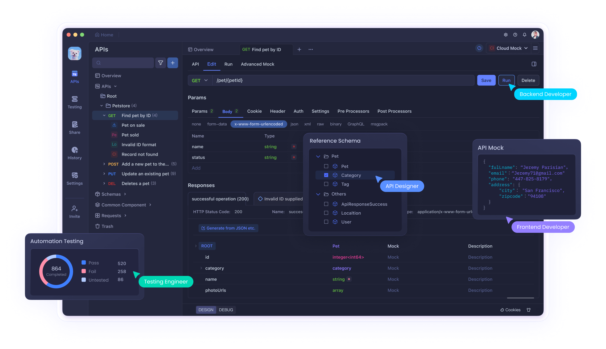

# Apidog ?
> [Apidog 공식 홈페이지](https://apidog.com/)

올인원 API 협업툴로, API 설계를 중심으로 개발하는 접근방식을 준수합니다.  
Back-end, Front-end, QA 담당 개발자들은 설계된 문서를 기준으로 유기적인 개발을 수행합니다.

## 목차
* [API 디자인](./pages/api-design/README.md)
* [API 문서화 및 공유](./pages/api-documentation-sharing/README.md)
* [API 요청](./pages/api-request/README.md)
* [Branch](./pages/branch/README.md)
* [API Mocking](./pages/api-mocking/README.md)
* [테스트 자동화](./pages/automation-test/README.md)
* [기타 부가기능](./pages/other-feature/README.md)

## 참고문서
* [Apidog : Learns > Help Docs](https://apidog.com/help/)